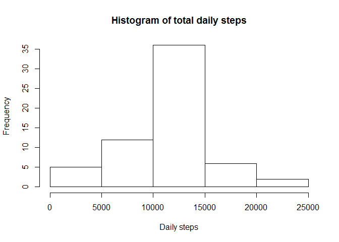
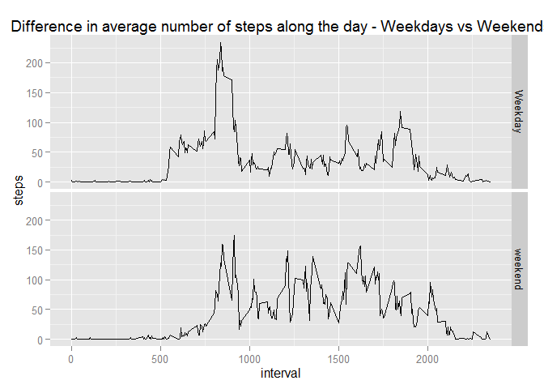

# Reproducible Research: Peer Assessment 1


## Loading and preprocessing the data
First step is to unzip the data, and load it in the variable *data*, as well as load the appropriate libraries.

```r
unzip("Activity.zip")
data<-read.csv("Activity.csv",stringsAsFactors = FALSE)
library(ggplot2)
```

```
## Warning: package 'ggplot2' was built under R version 3.0.3
```

The data contains one measure (*steps*) and two dimensions (*date* and *interval*)
I break *interval* down into hours and minutes and create a dimension timestamp.

```r
data$hour <- data$interval%/%100
data$minute <- data$interval%%100
data$timestamp <- as.POSIXct(data$date)+data$hour*60*60+data$minute*60
```


## What is mean total number of steps taken per day?
I first aggregate the data set to compute the total number of steps walked for each day, in the dataset *steps_per_day*.

```r
steps_per_day<-aggregate(steps~date,data=data,FUN=sum,na.rm=TRUE)$steps
```

Statistics on the average number of steps per day can then be computed and plotted.

```r
MeanSteps<- mean(steps_per_day)
MedianSteps<- median(steps_per_day)
hist(steps_per_day,main="Histogram of total daily steps",
  xlab="Daily steps", ylab="Frequency")
```

 

The average and median can then be computed to **10766** and **10765** respectively.


## What is the average daily activity pattern?
I first aggregate the data set to compute the number of steps walked on average within each day, in the dataset *steps_per_interval*.

```r
steps_per_interval<-aggregate(steps~interval+hour+minute,data=data,FUN=mean)
```

Statistics on the average number of steps within a day can then be computed and plotted.

```r
qplot(interval,steps,data=steps_per_interval, geom="line")
```

 

```r
maximum <- steps_per_interval[steps_per_interval$steps == max(steps_per_interval$steps),]
maximum
```

```
##     interval hour minute    steps
## 177      835    8     35 206.1698
```

With a total of **206 steps**, the interval with on average the largest number of steps is **835**, which means **8 hours and 35 minutes**.

## Imputing missing values
There are a significant number of missing values in the data set.

```r
NA_values <- sum(is.na(data$steps))
NA_values
```

```
## [1] 2304
```

```r
Total_Values <- length(data$steps)
```
In total, there are total of **2304 NA values** in the data set, which means **13.1% of all data**.

I will replace the NA values by the average of the corresponding interval. I favour the average interval, as the variability intra day is larger than the variability across all days.  
The required dataset was computed earlier, by aggregating the initial data source, to compute the average number of steps for each time interval.

```r
head(steps_per_interval)
```

```
##   interval hour minute     steps
## 1        0    0      0 1.7169811
## 2      100    1      0 0.3207547
## 3      200    2      0 0.0000000
## 4      300    3      0 0.0000000
## 5      400    4      0 1.1886792
## 6      500    5      0 0.0000000
```

These averages are inserted in the main dataset and a new variable called **steps_cleaned** is computed by replacing the value if it is NA.

```r
data_cleaned <- merge(x=data,y=steps_per_interval,by="interval",all.x=TRUE)
data_cleaned[is.na(data_cleaned$steps.x),]$steps.x <- data_cleaned[is.na(data_cleaned$steps.x),]$steps.y
data_cleaned$steps<-data_cleaned$steps.x
sum(is.na(data_cleaned$steps))
```

```
## [1] 0
```

Similarly to what was done earlier, I can aggregate the data set to compute the number of steps walked for each day, in the dataset *steps_per_day_noNA*.

```r
steps_per_day_noNA<-aggregate(steps~date,data=data_cleaned,FUN=sum,na.rm=TRUE)$steps
```

Statistics on the average number of steps per day can then be computed and plotted.

```r
MeanSteps_noNA<- mean(steps_per_day_noNA)
MedianSteps_noNA<- median(steps_per_day_noNA)
hist(steps_per_day_noNA,main="Histogram of total daily steps",
  xlab="Daily steps", ylab="Frequency")
```

 

The average and median can then be re-computed to **10766** and **10766** respectively, yielding almost no difference.

## Are there differences in activity patterns between weekdays and weekends?
Using *weekdays()*, I create a new variable, which is *TRUE* for weekend days, and *FALSE* for weekdays.

```r
data$weekday <- factor(weekdays(as.Date(data$date)))
data$IS_weekend <- factor((data$weekday =="samedi") | (data$weekday =="dimanche"))
levels(data$IS_weekend) <- c("Weekday","weekend")
```

As earlier, I aggregate this data source, to compute the average number of steps perfor each time interval.

```r
mean_steps_per_interval<-aggregate(steps~interval+IS_weekend,data=data,FUN=mean)
head(mean_steps_per_interval)
```

```
##   interval IS_weekend     steps
## 1        0    Weekday 2.3333333
## 2        5    Weekday 0.4615385
## 3       10    Weekday 0.1794872
## 4       15    Weekday 0.2051282
## 5       20    Weekday 0.1025641
## 6       25    Weekday 1.5128205
```

I can then plot the average number of step for each 5min interval, both for weekends and weekdays. 

```r
ggplot(mean_steps_per_interval, aes(x=interval, y=steps)) +
   geom_line() +
   facet_grid(IS_weekend ~ .) +
   ggtitle("Difference in average number of steps along the day - Weekdays vs Weekends") 
```

 

We observe a much larger activity in the mornings (8:00AM to 9:00AM) and evenings (6:00PM to 7:PM), reflecting commuting, while weekends exhibit a much more constant activity, as well as slightly higher.

